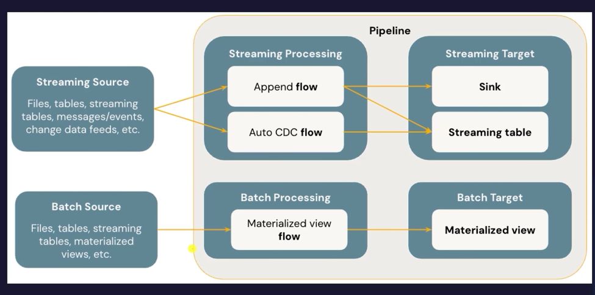
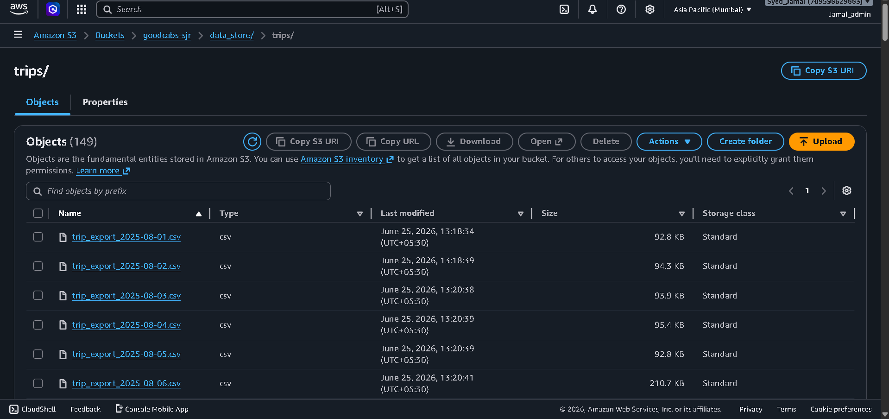
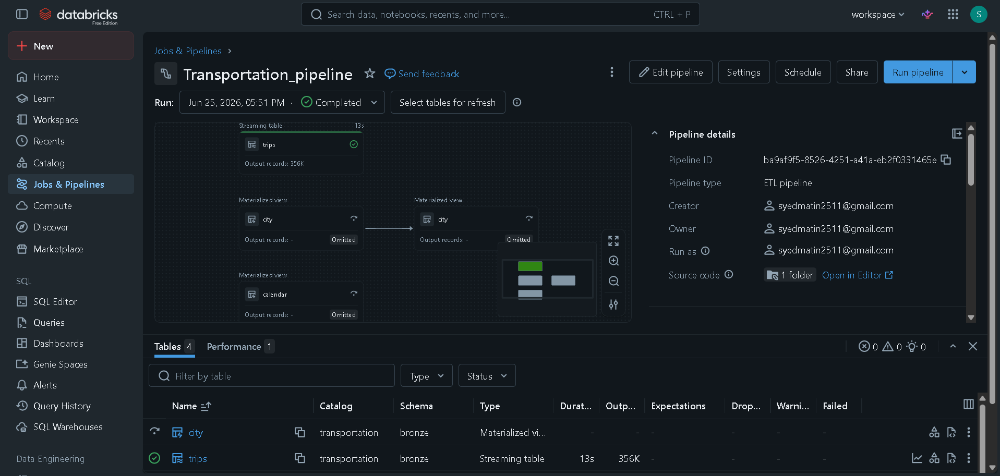
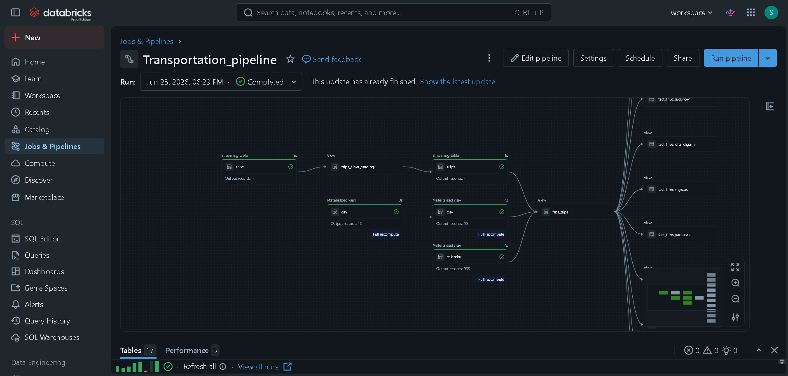

# 🚕 GoodCabs — End-to-End Transportation Data Engineering on Databricks

> A production-grade data engineering pipeline built on **Databricks Free Edition** using **Lakeflow Spark Declarative Pipelines (SDP)**, AWS S3, and the Medallion Architecture — from raw CSV ingestion to BI-ready gold tables.

---

## 📌 Project Overview

GoodCabs is a ride-hailing analytics platform that processes daily trip exports across 10 Indian cities. This project replicates a real-world data engineering workflow, demonstrating how modern declarative pipeline patterns replace brittle imperative ETL code.

**Domain:** Transportation Analytics  
**Stack:** Databricks Free Edition · AWS S3 · Lakeflow Declarative Pipelines · Unity Catalog · Delta Lake  
**Pipeline Type:** ETL Pipeline (Streaming + Batch)

---

## 🏗️ Solution Architecture


Data flows from a simulated **Data Fetch Service** into an **Amazon S3** bucket, then progresses through three medallion layers inside the Databricks Workspace — all governed by Unity Catalog and orchestrated by **Lakeflow Declarative Pipelines**.

| Layer | Purpose | Table Type |
|-------|---------|-----------|
| 🥉 Bronze | Raw ingestion, no transformation | Streaming Table |
| 🥈 Silver | Cleaned, validated, conformed data | Materialized View / Streaming Table |
| 🥇 Gold | BI-ready aggregates by city | View |

Outputs feed **Databricks Dashboards** and the **Genie** AI-powered Q&A interface.

---

## ⚡ Lakeflow Spark Declarative Pipelines — The Core Technology

### What is Lakeflow SDP?

**Lakeflow Spark Declarative Pipelines** (formerly Delta Live Tables) is Databricks' orchestration framework where you *declare what data should look like* — not *how to process it step by step*. The engine handles execution order, incremental refresh, fault tolerance, and lineage automatically.

### Declarative vs Imperative

| Aspect | Imperative (traditional) | Declarative (Lakeflow SDP) |
|--------|--------------------------|---------------------------|
| You write | Step-by-step transformations | What the output should look like |
| Error handling | Manual try/catch everywhere | Built-in, automatic retry |
| Incremental load | Custom watermark logic | Automatic via `STREAM()` |
| Dependencies | Manually managed | Auto-inferred from query references |
| Data quality | External checks | Native `CONSTRAINT` expectations |

### Pipeline Flow Diagram



Lakeflow SDP supports two processing paradigms within one pipeline:

**Streaming Processing (left path)**
- Sources: Files, Kafka topics, Change Data Feeds, streaming tables
- Flows: `Append flow` or `Auto CDC flow`
- Target: **Streaming Table** — append-only, low-latency ingestion

**Batch Processing (right path)**
- Sources: Files, tables, materialized views
- Flow: `Materialized view flow`
- Target: **Materialized View** — full or incremental recompute on each pipeline run

---

## 🔧 Pipeline Implementation

### Bronze Layer — Raw Ingestion from S3

Trip CSV files land daily in an AWS S3 bucket, partitioned by date.



The S3 `trips/` prefix contains **149 objects** — one CSV file per day (e.g., `trip_export_2025-08-01.csv`), each ranging from ~90 KB to ~210 KB. In Lakeflow SDP, Auto Loader reads these files incrementally using `STREAM()`, ingesting only new arrivals on each pipeline run.

```sql
CREATE OR REFRESH STREAMING TABLE trips
COMMENT "Bronze: raw trip records streamed from S3"
AS SELECT * FROM STREAM(read_files(
  's3://goodcabs-sjr/data_store/trips/',
  format => 'csv',
  header => true,
  inferSchema => true
));
```

The `city` and `calendar` dimension tables are declared as **Materialized Views** at the Bronze layer — batch-sourced from lookup files in S3.

### Silver Layer — Cleaning & Conformation

After Bronze ingestion, two parallel tracks run:

1. **`trips_silver_staging`** (View) — intermediate deduplication and type casting
2. **`trips`** (Streaming Table, Silver) — final cleaned streaming table with data quality constraints
3. **`city`** (Materialized View) — conformed city dimension with 10 records, full recompute
4. **`calendar`** (Materialized View) — 365-day calendar spine, full recompute

```sql
CREATE OR REFRESH STREAMING TABLE silver.trips (
  CONSTRAINT valid_trip_id EXPECT (trip_id IS NOT NULL) ON VIOLATION DROP ROW,
  CONSTRAINT valid_distance EXPECT (distance_km > 0) ON VIOLATION DROP ROW
)
AS SELECT * FROM STREAM(bronze.trips);
```

### Gold Layer — BI-Ready Aggregates



The initial Bronze pipeline run completed in **13 seconds**, outputting **356K records** into the `trips` streaming table. The `city` and `calendar` materialized views showed "Omitted" at this stage — correctly deferred pending Silver data.

### Full Pipeline — All 17 Tables



The complete pipeline DAG shows the full lineage across all 17 tables across Bronze and Silver, flowing into city-partitioned Gold views:

- `fact_trips` — master fact view
- `fact_trips_lucknow`, `fact_trips_chandigarh`, `fact_trips_mysore`, `fact_trips_vadodara`, ... (one view per city)

The pipeline completed in under **10 seconds** for the Silver recompute, with zero errors, warnings, or failed expectations (0 ⊗ / 0 △ / 0 ☀).

---

## 📂 Repository Structure

```
goodcabs-transportation/
├── pipelines/
│   ├── bronze/
│   │   ├── trips_bronze.sql          # Streaming table from S3
│   │   ├── city_bronze.sql           # City dimension MV
│   │   └── calendar_bronze.sql       # Calendar dimension MV
│   ├── silver/
│   │   ├── trips_silver_staging.sql  # Intermediate view
│   │   ├── trips_silver.sql          # Cleaned streaming table
│   │   ├── city_silver.sql           # Conformed city MV
│   │   └── calendar_silver.sql       # Calendar spine MV
│   └── gold/
│       ├── fact_trips.sql            # Master fact view
│       └── fact_trips_*.sql          # City-partitioned views
├── setup/
│   ├── create_catalog_schemas.sql    # Unity Catalog setup
│   └── s3_connection.md             # External location config
└── README.md
```

---

## 🚀 How to Replicate

### Prerequisites
- [Databricks Free Edition](https://bit.ly/4nK0NTN) account
- AWS account with an S3 bucket
- Trip export CSV files (see dataset link below)

### Steps

1. **Create Unity Catalog structure**
   ```sql
   CREATE CATALOG transportation;
   CREATE SCHEMA transportation.bronze;
   CREATE SCHEMA transportation.silver;
   CREATE SCHEMA transportation.gold;
   ```

2. **Connect S3 to Databricks**  
   Create an External Location in Unity Catalog pointing to your S3 bucket path `s3://your-bucket/data_store/`.

3. **Upload CSV files to S3**  
   Place daily trip exports under `s3://your-bucket/data_store/trips/` following the naming convention `trip_export_YYYY-MM-DD.csv`.

4. **Create the Lakeflow Pipeline**
   - Go to **Jobs & Pipelines → Create Pipeline**
   - Select pipeline type: **ETL Pipeline**
   - Add the `/pipelines/` folder as the source code location
   - Set target catalog to `transportation`

5. **Run the pipeline**  
   Click **Run pipeline** — Databricks infers the full DAG automatically from table references. No manual dependency wiring needed.

6. **Incremental loads**  
   On subsequent runs, only new CSV files in S3 are processed by the streaming tables. Materialized views recompute only changed partitions.

---

## 🔑 Key Lakeflow SDP Benefits

| Benefit | How it manifests in this project |
|---------|----------------------------------|
| **Auto-incremental ingestion** | New daily CSV files picked up automatically via Auto Loader |
| **Automatic lineage** | Full DAG from S3 → Bronze → Silver → Gold visible in the pipeline graph |
| **Built-in data quality** | `CONSTRAINT` expectations drop or quarantine invalid rows without custom code |
| **Zero-maintenance orchestration** | No Airflow DAGs, no dependency management, no manual triggers |
| **Full recompute vs incremental** | Materialized views choose the optimal strategy per run automatically |
| **Unity Catalog integration** | All tables registered in the catalog with fine-grained access control |

---

## 📊 Pipeline Results

| Table | Layer | Type | Records | Duration |
|-------|-------|------|---------|---------|
| `trips` | Bronze | Streaming Table | 356K | 13s |
| `city` | Silver | Materialized View | 10 | 3s |
| `calendar` | Silver | Materialized View | 365 | 4s |
| `trips` | Silver | Streaming Table | — | 1s |
| `fact_trips` | Gold | View | — | — |
| 12 city views | Gold | View | — | — |

**Total pipeline tables: 17 | Total errors: 0 | Total warnings: 0**

---

## 📚 Resources

- 📹 [Original Tutorial — Codebasics](https://www.youtube.com/watch?v=bIIC44n2Dss)
- 📦 [Dataset & Code — codebasics.io](https://codebasics.io/resources/databricks)
- 🔗 [Databricks Free Edition Signup](https://bit.ly/4nK0NTN)
- 📖 [Lakeflow Declarative Pipelines Docs](https://docs.databricks.com/en/dlt/index.html)

---

## 🙏 Acknowledgements
Project inspired by the **Codebasics** *End-to-End Data Engineering with Databricks Free Edition* micro-course by Dhaval Patel and Hem Vad.

---

*Built with ❤️ on Databricks Free Edition — no cluster bills were harmed in the making of this project.*


